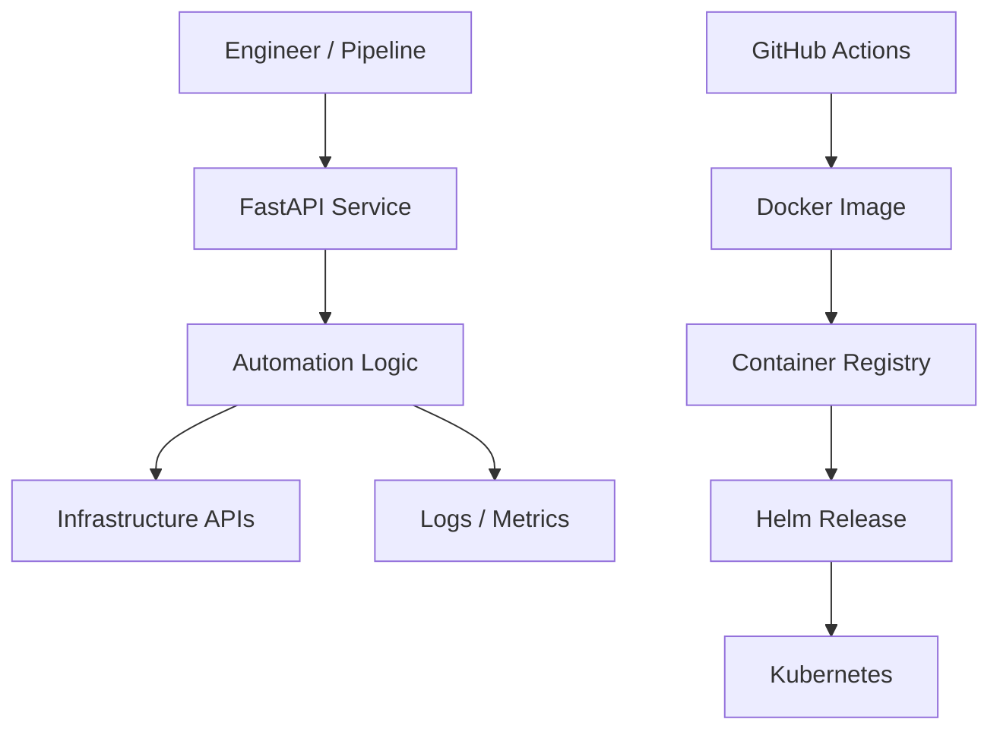

# Architecture

```mermaid
flowchart TB
    User[Engineer / Pipeline] --> Api[FastAPI Service]
    Api --> Agent[Automation Logic]
    Agent --> Target[Infrastructure APIs]
    Agent --> Telemetry[Logs / Metrics]
    CI[GitHub Actions] --> Image[Docker Image]
    Image --> Registry[Container Registry]
    Registry --> Helm[Helm Release]
    Helm --> K8s[Kubernetes]
```
